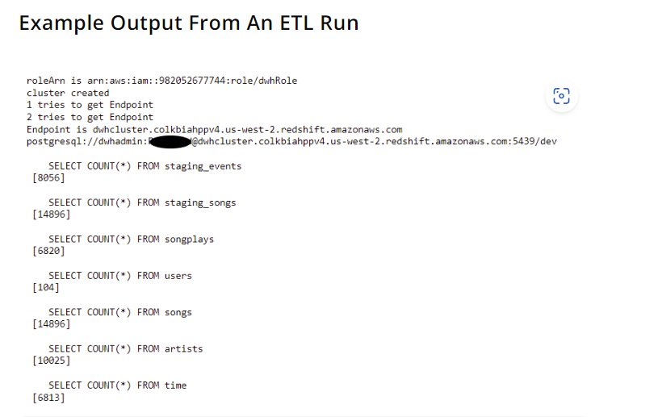

## Project: Data Warehouse on UDATACITY By MinhTB7@Fpt.com

- This project demonstrate about step by step to use broto3 to interact with S3 resources and load data from S3 to Redshift
- I have provide dwh_temaplate.cfg file, you are able to copy into new file and fill all information
- For below expectation of project, you are able to refer [Jupyter nootbooke](./Udacity-DEND-Project-2-AWS-Setup.ipynb) to run and show all process to create and show all resoures we hjust have created
  
